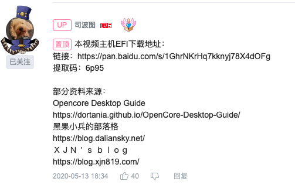
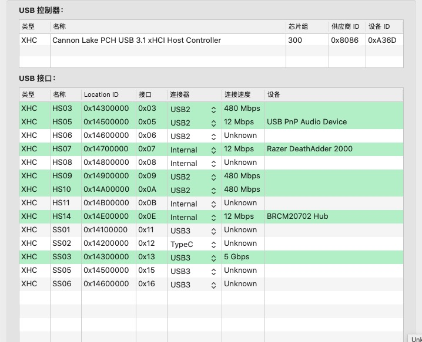
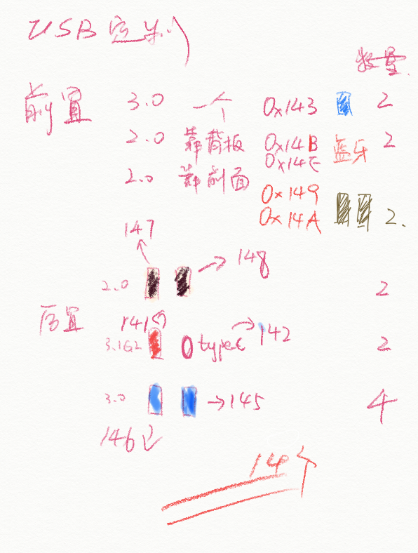
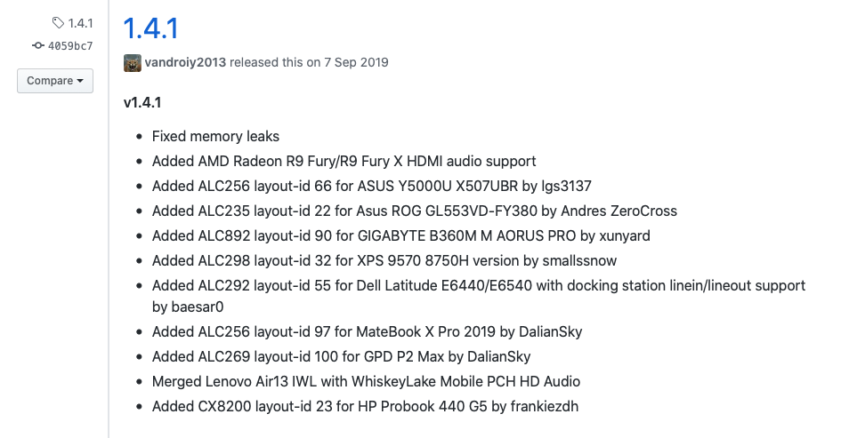

### 0. ！！！clover跟opencore不能混用 更换引导要清一下nvram ！！！

### 0. ！！！ 使用前手动更换三码！！！

### 1. 配置信息
* mb: gigabyte b360m aorus pro
* cpu: i7 8700es qn8h
* mem: 16g ddr4 3000(2666) Corsair +16g ddr4 3000(2666) asgard
* igpu: uhd630
* egpu: rx570 8g xfx
* nvme: sumsuang pm961 256g
* wifi&bluetooth: bcm943224pciebt2 in pcie adapter card
* ONBOARD-DEV : ALC892 I219-V

* bios: f3
    - windows 8/10 : other
    - csm : disable
    - encoding-4g : enable
    - superIO-serialport : disable
    - xhci hand-off : enable
    - vt-d : disable
    - internal graphics : enable
    - above 4g deconding : enable
    
* opencore-0.5.8

### 2. opencore 配置教程
b站 [司波图](https://space.bilibili.com/28457) 教程 [Intel Coffee Lake平台完美黑苹果系统安装教程（Opencore+Catalina15.4)](https://www.bilibili.com/video/BV1hA411t7dr)

### 3. 其他设置

#### 3.1 usb定制：
b站 [大头蔡Cass](https://space.bilibili.com/16323318) 教程 [黑苹果定制USB教程简易版，2步搞定USB定制](https://www.bilibili.com/video/BV1rt4y1y7Pb)

附上我的主板定制的usb

#### 3.2 cfg解锁教程：
b站 [大头蔡Cass](https://space.bilibili.com/16323318) 教程 [解锁主板CFG，体验更完美的黑苹果](https://www.bilibili.com/video/BV1ka4y1x7Z2)

**！！使用相同的命令可以解锁！！**

#### 3.3 appplealc 音频
硬件 **ALC892**
在applealc的作者的更新信息找到了主板的 **layout-id 90** 

